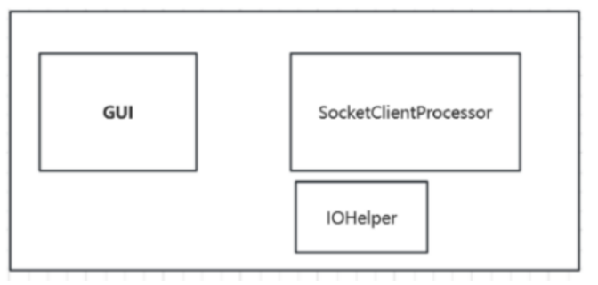
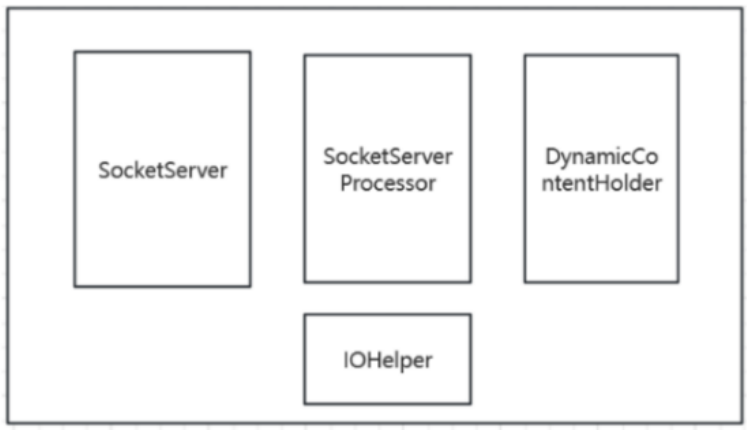
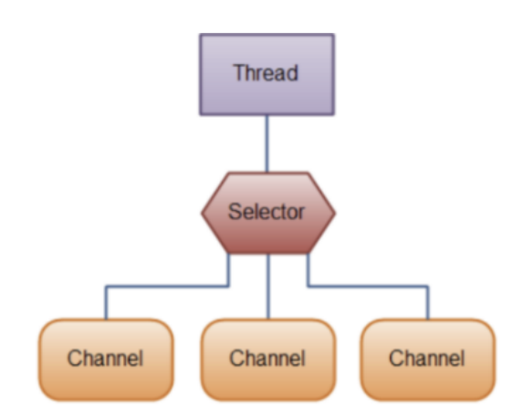
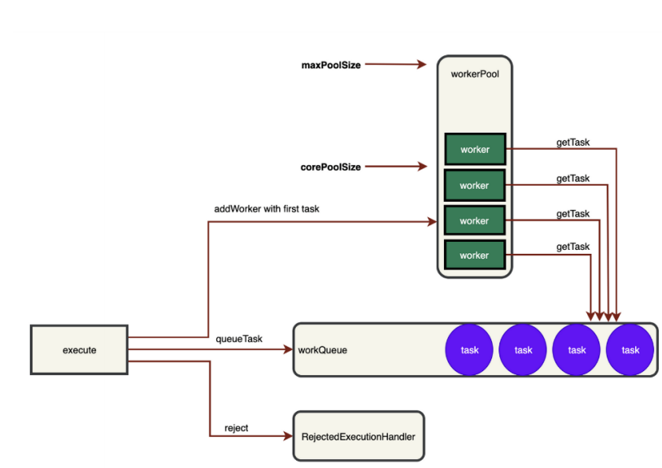
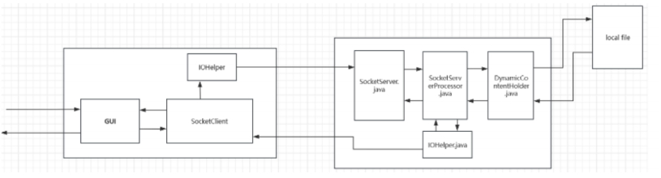

# Multi-threaded-Dictionary-Server
The server-client based on the Socket protocol adopts connection management and multi-threaded task processing technologies.

## Introduction

Using a client-server architecture, the project aims to implement a multi-threaded server that allows concurrent clients to search the meaning(s) of a word, add a new word, and remove an existing word. Users should be able to perform the following operations through the GUI:

- Query the meaning(s) of a given word
- Add a new word
- Remove an existing word
- Adding additional meaning to an existing word
- Updating existing meaning of an existing word by new one

## Structure of The Repo

├── src/   # source of the project

└── README.md

## Design concept

### Components of the system

#### client 

##### GUI:

The user selects the type of operation to be performed through the graphical interface and inputs
the corresponding data through GUI. Subsequently, GUI shows feedback from the server (normal
/ error) .

##### SocketClientProcessor:

Responsible for implementing the main logic of the client: 

- Obtain user input information from the GUI, encapsulate and send it to the server

- Receive the returned messages from the server, and call the corresponding methods based

  on the message type to display them on the GUI

##### IOHelper

As a tool module, it is responsible for converting the sent/received data into the appropriate
format.

#### Server

##### SocketClient

As a multi-threaded server, it is responsible for establishing, maintaining and managing client

connections. 

- When a user connects, it encapsulates the connection into a connection class (SocketChannle)

- When a user sends a message, it triggers the write event and hands over the information to

  the corresponding processing class.

- When a user disconnects, it makes records and displays it

##### SocketServerProcessor

SocketServerProcessor is responsible for implementing the addition, deletion, update and search
of the dictionary based on user requests through the tool module.

##### DynamicContentHolder:

DynamicContentHolder is responsible for managing the contents of the dictionary:

- When the system starts, it reads the dictionary from the local document and stores it into the

  cache. 

- After reading, it caches the dictionary for series of operations . 

- It writes the updated dictionary in the cache back to the local file.

##### IOHelper

As a tool module, it is responsible for converting the sent/received data into the appropriate
format.

### Class design

The **connection management modules** of both the client and the server adopt a single-threaded
polling (**SocketSelector**) approach to monitor each **SocketChannel** (the wrapper class for client
connections) to manage each connection. This mode has been proven to be a reliable way to
manage connections in a multi-threaded environment in some software (such as Redis).

The **SocketServerProcessor.java** (the business processing class of the server) processes the user
information obtained from the Channel through the ThreadPoolExecutor in a multi-threaded
manner. It can flexibly adjust its threads contained according to the concurrent load situation.

Both the **IOHelper** of the server and that of the client adopt the JSON format based on TCP
protocol for data transmission.

**DynamicContentHolder.java** of the server reads and writes of local files in character units
through Java's file-related classes (File, FileInputStream, FileOutputStream).

### Interaction diagram

When the user issues an operation command through the GUI, the client sends a request. After
the server receives the request, it performs corresponding operations on the cached dictionary
and returns the result. The client then displays the corresponding feedback based on the feedback
information received.

## Insight

During the project design process, I mainly focused on the realization of functions, but I failed to take into enough account some connection situations of the server in the case of multi-threading. For example, when the connection is closed during user usage, the server should provide log records, and it might also be necessary to reclaim the corresponding connection resources. Besides, for multi-threaded design, a more modular approach can also be adopted (that is, to modularize the thread connection management and the multi-threaded processing of tasks respectively).

In conclusion, for client-server program design, apart from fulfilling the basic functional requirements, I should more consider the following aspects: 

- Management and record of each user's connection situation (Establishment and disconnection of connections / Reception and return of messages)

- Management of multi-threaded tasks and avoidance of conflicts (while adopting an appropriate code structure) under multiple user connections.

I need to avoid repeatedly modifying the code during the project's code writing stage, which would waste lots of time .
